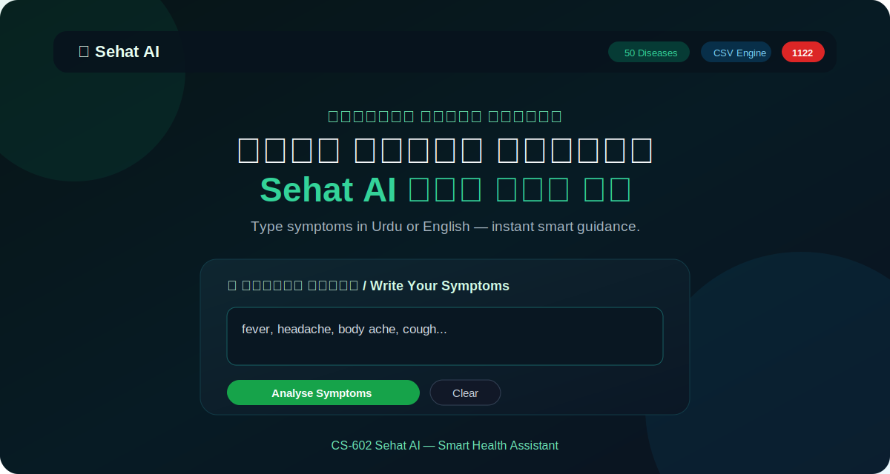

# CS-602 Sehat AI — Smart Health Assistant

**Sehat AI** is an AI-powered health and wellness assistant project for **CS-602**. It provides user-friendly healthcare guidance in **Urdu and English**, including symptom analysis, medicine information, emergency contact guidance, and a searchable disease directory.

> ⚠️ **Medical Disclaimer:** This project is for educational and preliminary guidance only. It is not a replacement for a qualified doctor, pharmacist, diagnosis, prescription, or emergency medical care.

---

## 📸 Project Screenshot

### Home Page / Symptom Input


---

## ✨ Main Features

- 🩺 **Symptom Analysis:** Users can enter symptoms in Urdu or English.
- 🤖 **Optional Gemini AI Mode:** Uses Gemini when a valid `GEMINI_API_KEY` is configured.
- 📋 **CSV Fallback Engine:** Works with local `diseases.csv` when AI key is not available.
- 💊 **Medicine Lookup:** Shows medicine uses, dosage guidance, side effects, and warnings.
- 🚨 **Emergency Help:** Displays Pakistan emergency contacts including Rescue 1122.
- 🔎 **Disease Directory:** Searchable disease list with category and emergency status.
- 🎙️ **Voice Input:** Browser-based speech recognition support.
- 🌐 **Bilingual UI:** Urdu + English interface.
- 🎨 **Responsive Design:** Clean Flask/Jinja frontend with CSS and JavaScript.

---

## 🧰 Tech Stack

- **Backend:** Python, Flask
- **Data Handling:** pandas, CSV dataset
- **Frontend:** HTML, CSS, JavaScript
- **AI Integration:** Google Gemini API, optional
- **Language Support:** Urdu and English

---

## 📁 Project Structure

```text
CS-602_Sehat_AI/
├── README.md
└── Sehat_AI/
    ├── app.py
    ├── diseases.csv
    ├── requirements.txt
    ├── screenshots/
    │   └── home-page.svg
    ├── static/
    │   ├── css/
    │   │   └── style.css
    │   └── js/
    │       └── app.js
    └── templates/
        └── index.html
```

---

## 🚀 How to Run Locally

### 1. Clone the Repository

```bash
git clone https://github.com/muhammadjunaidniazi/CS-602_Sehat_AI.git
cd CS-602_Sehat_AI/Sehat_AI
```

### 2. Create Virtual Environment

```bash
python -m venv venv
```

### 3. Activate Virtual Environment

**Windows:**

```bash
venv\Scripts\activate
```

**Linux/macOS:**

```bash
source venv/bin/activate
```

### 4. Install Requirements

```bash
pip install -r requirements.txt
```

### 5. Optional: Set Gemini API Key

```bash
set GEMINI_API_KEY=your_api_key_here
```

For Linux/macOS:

```bash
export GEMINI_API_KEY=your_api_key_here
```

### 6. Run the Flask App

```bash
python app.py
```

Open in browser:

```text
http://127.0.0.1:5000
```

---

## 🧪 Available Routes

| Route | Method | Purpose |
|---|---:|---|
| `/` | GET | Main web interface |
| `/analyze` | POST | Analyze symptoms |
| `/api/medicine` | POST | Medicine information lookup |
| `/api/diseases` | GET | Disease directory data |
| `/api/stats` | GET | Dataset statistics |
| `/api/emergency-contacts` | GET | Emergency contact numbers |

---

## 🔐 Important Note About API Keys

Never upload real API keys to GitHub. Use environment variables such as:

```python
os.environ.get("GEMINI_API_KEY")
```

---

## 👨‍💻 Author

**Muhammad Junaid Niazi**  
BS Computer Science  
University Project: **CS-602 Sehat AI**

---

## 📌 Project Status

✅ Core Flask app added  
✅ CSV-based disease engine added  
✅ Medicine lookup added  
✅ Screenshot preview added  
🔄 More screenshots and deployment guide can be added later
